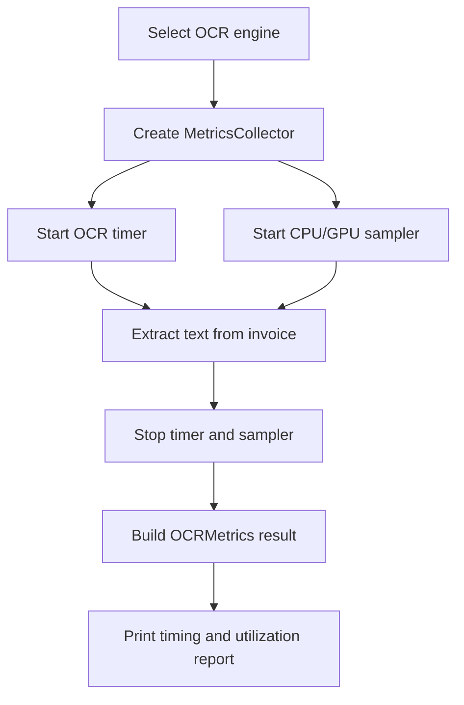

# OCR Monitoring

## Overview

The OCR demo measures the cost of each image-processing run in addition to
extracting text. `MetricsCollector` combines elapsed-time measurement with
periodic CPU and GPU utilization sampling, so the same monitoring workflow can
be used with both supported engines.

The collected metrics are:

- Elapsed processing time in seconds
- Average and maximum system CPU utilization
- Average and maximum utilization for every detected NVIDIA GPU
- Device baseline information: logical CPU cores, RAM, GPU name, and VRAM

GPU utilization is reported as `0.0%` in the results below because the sampled
GPU did not perform measurable work during these runs. CPU monitoring remains
available when no NVIDIA GPU or NVML driver is detected.

## Architecture



`ComputeMonitor` samples system usage every `0.2` seconds by default in a
background thread. `OCRTimer` measures the OCR operation with a monotonic
performance counter. The two summaries are combined into an `OCRMetrics`
instance when the context manager exits.

## Installation and Configuration

Install the project dependencies with:

```bash
uv sync
```

The monitoring stack uses `psutil` for CPU data and `pynvml` for NVIDIA GPU
data. PaddleOCR and PaddlePaddle are required when `paddleocr` is selected.

In `main.py`, choose the engine and configure the input images:

```python
engine_name = "paddleocr"  # or "tesseract"
clear_path = "path/to/clear-invoice.jpg"
blurred_path = "path/to/blurred-invoice.jpg"
```

Run the demo with:

```bash
uv run python main.py
```

## Recorded Device Baseline

| Resource | Recorded value |
|---|---|
| Logical CPU cores | 32 |
| System RAM | 63.7 GB |
| GPU | NVIDIA RTX 3500 Ada Generation Laptop GPU |
| GPU VRAM | 12.0 GB |

## Results

### Tesseract

| Input image | Time (s) | CPU average | CPU maximum | GPU average | GPU maximum |
|---|---:|---:|---:|---:|---:|
| Clear invoice | 0.976 | 10.4% | 18.5% | 0.0% | 0.0% |
| Blurred invoice | 0.735 | 9.8% | 17.7% | 0.0% | 0.0% |

### PaddleOCR

| Input image | Time (s) | CPU average | CPU maximum | GPU average | GPU maximum |
|---|---:|---:|---:|---:|---:|
| Clear invoice | 145.221 | 30.2% | 54.5% | 0.0% | 0.0% |
| Blurred invoice | 98.928 | 35.9% | 52.2% | 0.0% | 0.0% |

## Engine Comparison

| Engine | Clear invoice (s) | Blurred invoice (s) | Average CPU | Peak CPU |
|---|---:|---:|---:|---:|
| Tesseract | 0.976 | 0.735 | 10.1% | 18.5% |
| PaddleOCR | 145.221 | 98.928 | 33.1% | 54.5% |

These measurements show that Tesseract completed both runs substantially faster
and with lower CPU utilization in this environment. The results describe one
local run per image and should not be treated as a general benchmark.

